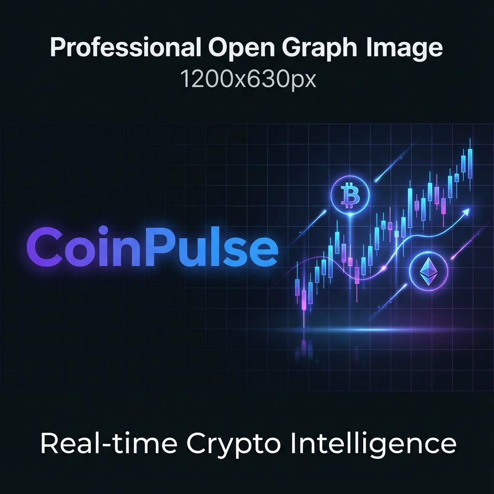

<div align="center">
  <br />
  
  <br />

  <div>


  </div>

  <h1 align="center">🚀 CoinPulse</h1>
  <h3 align="center">Real-time Crypto Intelligence Dashboard</h3>

   <div align="center">
     <p>Suivez les marchés crypto en temps réel. Dashboard avancé, graphiques interactifs et terminal haute fréquence pour traders et investisseurs.</p>
    </div>
</div>

## 📋 <a name="table">Table of Contents</a>

1. ✨ [Introduction](#introduction)
2. ⚙️ [Tech Stack](#tech-stack)
3. 🔋 [Features](#features)
4. 🤸 [Quick Start](#quick-start)
5. 🌐 [Internationalization](#i18n)

## <a name="introduction">✨ Introduction</a>

**CoinPulse** est un dashboard d'analyse crypto haute performance construit avec **Next.js 16**, **TailwindCSS v4** et **next-intl** pour l'internationalisation. L'application offre une intelligence de marché en temps réel via l'API CoinGecko et les WebSockets, avec des graphiques candlestick interactifs TradingView pour visualiser les données OHLCV avec précision. Du tableau de bord dynamique affichant les statistiques globales aux pages de tokens détaillées avec convertisseurs multi-devises, la plateforme fournit une stack modulaire optimisée pour la rapidité et la clarté.

## <a name="tech-stack">⚙️ Tech Stack</a>

- **[Next.js](https://nextjs.org)** is a powerful React framework for building full-stack web applications. It simplifies development with features like server-side rendering, static site generation, and API routes, enabling developers to focus on building products and shipping quickly.

- **[TypeScript](https://www.typescriptlang.org/)** is a superset of JavaScript that adds static typing, providing better tooling, code quality, and error detection for developers. It is ideal for building large-scale applications and enhances the development experience.

- **[Tailwind CSS](https://tailwindcss.com/)** is a utility-first CSS framework that allows developers to rapidly build modern websites by composing styles directly in their HTML markup, which facilitates highly customized designs and ensures the smallest possible production CSS bundles.

- **[Shadcn/ui](https://ui.shadcn.com/docs)** is a collection of beautifully-designed, accessible React components that you copy and paste directly into your project (it is not a traditional npm library), giving you full source code ownership and total customization control to build your own design system often utilizing Tailwind CSS.

- **[CodeRabbit](https://jsm.dev/crypto-rabbit)** is an AI-powered code review platform that integrates into Git workflows (like GitHub and GitLab) to automatically analyze pull requests, identifying issues ranging from readability concerns to logic bugs and security flaws, and offering one-click fixes to help teams ship high-quality code faster.

- **[CoinGecko API](https://jsm.dev/crypto-gecko)** is a comprehensive and reliable RESTful API that provides real-time and historical cryptocurrency market data, including prices, market capitalization, volume, and exchange information, enabling developers to build crypto tracking, analysis, and portfolio management applications.

- **[TradingView](https://www.tradingview.com/lightweight-charts/)** is a high-performance financial visualization library that provides interactive charting capabilities for rendering complex OHLCV data. It enables the integration of responsive candlestick charts and technical indicators, allowing users to perform professional-grade technical analysis with low-latency updates and surgical precision.

## <a name="features">🔋 Features</a>

👉 **Home Dashboard**: Displays crucial market health indicators like **Total Market Cap** and **BTC & ETH dominance**, alongside a dynamic list of **Trending Tokens**, all retrieved instantly using the CoinGecko `/global` and `/search/trending` endpoints.

👉 **Token Discovery Page**: A comprehensive, sortable and searchable table featuring key token metrics (Price, 24h change, Market Cap Rank) for mass market analysis, powered by the scalable `/coins/markets` REST API and optimized with pagination for efficient browsing.

👉 **Detailed Token Overview**: Provides an immediate summary of any selected token, including its logo, current price, and market cap rank, utilizing the `/coins/{id}` REST API for core data and the **CGSimplePrice WebSocket** for continuous, live price monitoring.

👉 **Interactive Candlestick Chart**: Integrates **TradingView Lightweight Charts** to visualize market trends and price action with surgical precision, rendering multi-timeframe OHLCV data fetched from CoinGecko’s high-performance market endpoints.

👉 **Real-Time Trades & Orderbook**: Features a live stream of market activity exactly as it happens on the exchange, using low-latency WebSockets to display a constant flow of buy/sell orders and recent trade executions.

👉 **Smart Currency Converter**: An interactive tool that allows users to instantly compute coin amounts into dozens of supported fiat and crypto currencies, leveraging the `/simple/supported_vs_currencies` and `/simple/price` endpoints for accurate conversions.

👉 **Exchange & Trading Pairs**: Allows users to analyze trading context by displaying aggregated lists of exchanges and available trading pairs, with all data sourced directly from the dedicated `/exchanges` and `/exchanges/{id}/tickers` REST APIs.

👉 **Global Search Functionality**: A powerful, unified search bar that allows users to quickly locate any crypto asset by name or symbol, linking directly to the respective Token Detail Page via the CoinGecko `/search` and `/coins/{id}` REST endpoints.

And many more, including code architecture and reusability.

## <a name="quick-start">🤸 Quick Start</a>

Follow these steps to set up the project locally on your machine.

**Prerequisites**

Make sure you have the following installed on your machine:

- [Git](https://git-scm.com/)
- [Node.js](https://nodejs.org/en)
- [npm](https://www.npmjs.com/) (Node Package Manager)

**Cloning the Repository**

```bash
git clone https://github.com/adrianhajdin/coinpulse.git
cd coinpulse
```

**Installation**

Install the project dependencies using npm:

```bash
npm install
```

**Set Up Environment Variables**

Create a new file named `.env` in the root of your project and add the following content:

```env
COINGECKO_BASE_URL=https://pro-api.coingecko.com/api/v3
COINGECKO_API_KEY=

NEXT_PUBLIC_COINGECKO_WEBSOCKET_URL=
NEXT_PUBLIC_COINGECKO_API_KEY=
```

Replace the placeholder values with your real credentials. You can get these by signing up at: [**Example**](https://jsm.dev/example).

**Running the Project**

```bash
npm run dev
```

Open [http://localhost:3000](http://localhost:3000) in your browser to view the project.

## <a name="links">🔗 Assets</a>

Assets and snippets used in the project can be found in the **[video kit](https://jsmastery.com/video-kit/d1bcad71-45c0-477c-82c8-e71ae39ae6f4)**.

<a href="https://jsmastery.com/video-kit/d1bcad71-45c0-477c-82c8-e71ae39ae6f4" target="_blank">
  
</a>

## <a name="more">🚀 More</a>

**Advance your skills with Next.js Pro Course**

Enjoyed creating this project? Dive deeper into our PRO courses for a richer learning adventure. They're packed with
detailed explanations, cool features, and exercises to boost your skills. Give it a go!

<a href="https://jsm.dev/crypto-jsm" target="_blank">
  
</a>
