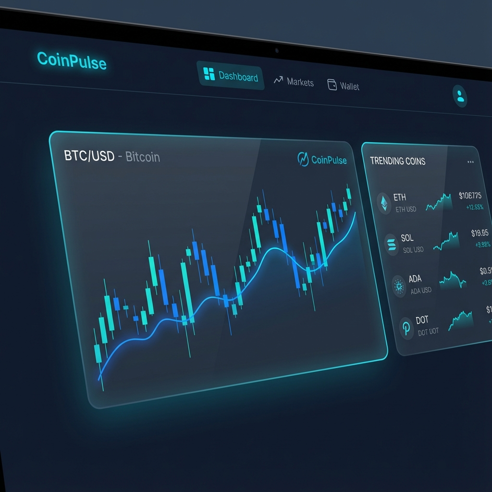
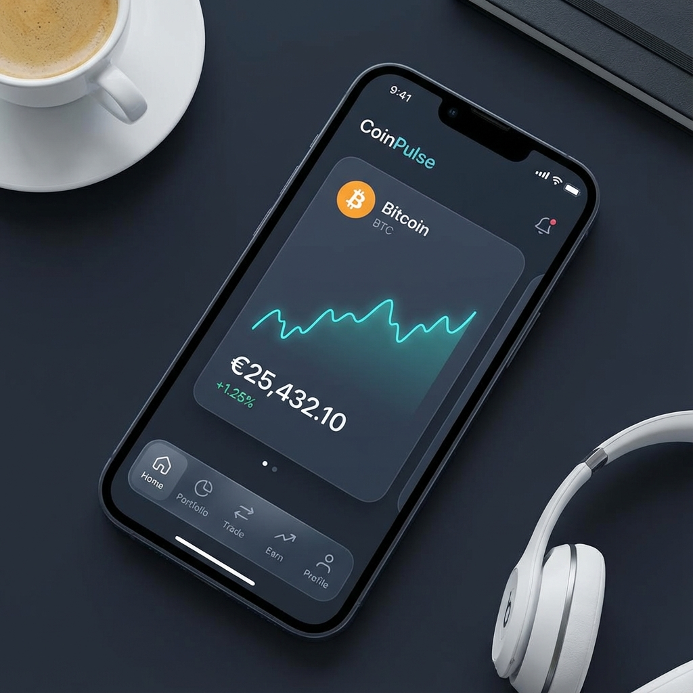

<div align="center">
  <br />
  
  <br />

  <h1 align="center" style="font-size: 3rem; font-weight: 800; margin-bottom: 0;">🚀 CoinPulse</h1>
  <h3 align="center" style="font-size: 1.5rem; color: #94a3b8; font-weight: 400; margin-top: 10px;">The Ultimate Real-Time Crypto Intelligence Dashboard</h3>

  <div style="margin-top: 20px;">
    
    
    
    
  </div>

  <p align="center" style="max-width: 600px; margin: 30px auto; font-size: 1.1rem; line-height: 1.6; color: #cbd5e1;">
    <b>CoinPulse</b> brings institutional-grade crypto tracking to your browser. Re-engineered with a stunning <b>Slate & Cyan</b> glassmorphism interface, it delivers real-time market data, surgical-precision charting, and instant token analytics in a package that feels as good as it performs.
  </p>
</div>

---

## 💎 Experience the New Design

We've completely overhauled the visual experience to focus on clarity, depth, and data visibility.

<div align="center">
 
</div>

### ✨ Key Visual Features

- **Deep Slate Theme**: A custom-calibrated `#0a0e14` dark palette that reduces eye strain while maximizing contrast for charts and data.
- **Glassmorphism Spec**: Translucent cards with `backdrop-blur-sm` and subtle gradient borders create a sense of depth and hierarchy.
- **Alive Interactions**: Hover effects, glows, and smooth transitions bring the interface to life without distracting from the data.
- **Progressive Geometry**: A refined radius system (6px to 24px) that guides the eye naturally through information clusters.

---

## 🔋 Power Features

👉 **Real-Time Market Pulse**: Instant access to global market caps, BTC/ETH dominance, and live trending coins driven by CoinGecko's high-frequency endpoints.

👉 **Precision Charting**: A custom implementation of **TradingView Lightweight Charts**, offering responsive, interactive candlestick visualization for any asset.

👉 **Live Order Flow**: Watch trades happen in real-time with our WebSocket-powered trade history and order book visualization.

👉 **Smart Conversion**: A context-aware currency converter that handles multi-fiat and crypto pairs instantly.

👉 **Global Search**: Find any asset in seconds with our optimized global search engine, linking directly to deep-dive analytics pages.

---

## ⚙️ Built With Modern Tech

CoinPulse is crafted with the latest reliable web technologies:

- **Next.js 16** for lightning-fast server-side rendering and edge performance.
- **Tailwind CSS v4** for a high-performance, utility-first design system.
- **Shadcn/ui** for accessible, robust component primitives.
- **next-intl** for seamless internationalization and unmatched global reach.

---

## 🤸 Quick Start

Want to run CoinPulse locally?

1.  **Clone the repo**

    ```bash
    git clone https://github.com/adrianhajdin/coinpulse.git
    cd coinpulse
    ```

2.  **Install dependencies**

    ```bash
    npm install
    ```

3.  **Configure Environment**
    Create a `.env` file:

    ```env
    COINGECKO_BASE_URL=https://pro-api.coingecko.com/api/v3
    COINGECKO_API_KEY=your_key_here
    ```

4.  **Launch**
    ```bash
    npm run dev
    ```
    Visit `http://localhost:3000`.

---

<div align="center">
  <p style="color: #64748b; font-size: 0.9rem;">
    Designed & Engineered for the future of decentralized finance.
  </p>
</div>
